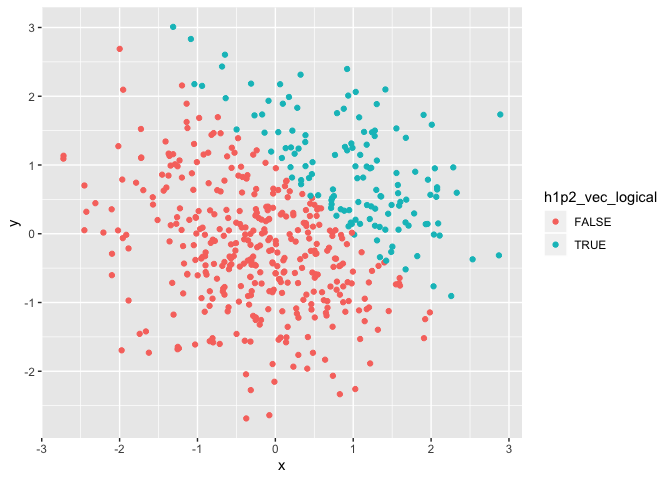
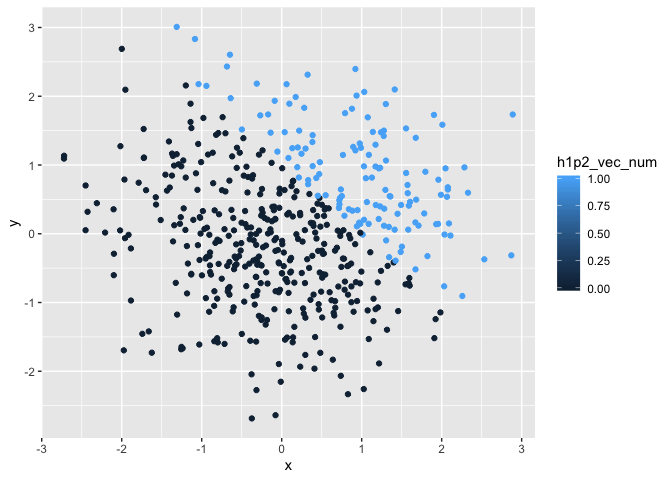
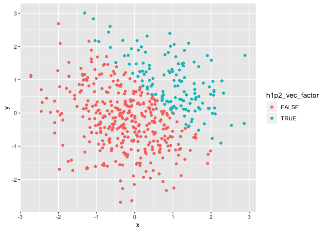

p8105\_hw1\_mrc2229.rmd
================
Matthew Curran
2019-09-19

``` r
library(tidyverse)
```

    ## ── Attaching packages ─────────────────────────────── tidyverse 1.2.1 ──

    ## ✔ ggplot2 3.2.1     ✔ purrr   0.3.2
    ## ✔ tibble  2.1.3     ✔ dplyr   0.8.3
    ## ✔ tidyr   0.8.3     ✔ stringr 1.4.0
    ## ✔ readr   1.3.1     ✔ forcats 0.4.0

    ## ── Conflicts ────────────────────────────────── tidyverse_conflicts() ──
    ## ✖ dplyr::filter() masks stats::filter()
    ## ✖ dplyr::lag()    masks stats::lag()

# Problem 1

## Creating the data frame for problem 1

``` r
set.seed(2)

p8105_hw1_df = tibble(
  h1p1_random_var = rnorm(8),
  h1p1_vec_logical = c(h1p1_random_var>0),
  h1p1_vec_char = c("A","character","variable","that","is", "eight","in", "length"),
  h1p1_vec_factor = factor(c("Low","Low","Low", "Med","Med","High", "High","High"))
)
```

## Taking the mean of the sample for each variable

  - The mean of the sample for the random variable is 0.0332287 I was
    able to take the mean of this variable because it is a set of
    numbers.

  - The mean of the sample for the logical vector is 0.5 I was able to
    take the mean of this variable because the logical vector only
    corresponds to true or false, which is coded as zeros and ones.

  - The mean of the sample for the character vector is NA I was not able
    to take the mean of this variable because it is only characters and
    no numbers.

  - The mean of the sample for the factor vector is NA I was not able to
    take the mean of this variable because it currently contains no
    numbers.

## Convert character, logical, and factor variables to numeric variables.

``` r
  as.numeric(pull(p8105_hw1_df, h1p1_vec_logical))
```

    ## [1] 0 1 1 0 0 1 1 0

``` r
  as.numeric(pull(p8105_hw1_df, h1p1_vec_char)) 
```

    ## Warning: NAs introduced by coercion

    ## [1] NA NA NA NA NA NA NA NA

``` r
  as.numeric(pull(p8105_hw1_df, h1p1_vec_factor))
```

    ## [1] 2 2 2 3 3 1 1 1

The logical vector variable was able to convert to numeric because true
and false were converted to ones and zeros. This is also why we could
take the mean of the logical variable.

The character vector variable could not convert to a numeric variable
because it was not able to assign numbers to characters that were
seemingly independent of one another.This is why we could not take a
mean of the character variable, it had no associated numbers.

The factor vector variable was able to convert to numeric because the
three levels were converted to one, two, or three. Prior to converting
to a numeric we could not take the mean, but now we likely could take
the mean as they now are associated with
numbers.

## Converting the logical vectors and multiplying by the random variable.

``` r
  as.numeric(pull(p8105_hw1_df, h1p1_vec_logical))*(pull(p8105_hw1_df, h1p1_random_var))
```

    ## [1] 0.0000000 0.1848492 1.5878453 0.0000000 0.0000000 0.1324203 0.7079547
    ## [8] 0.0000000

``` r
  as.factor(pull(p8105_hw1_df, h1p1_vec_logical))*(pull(p8105_hw1_df, h1p1_random_var))
```

    ## Warning in Ops.factor(as.factor(pull(p8105_hw1_df, h1p1_vec_logical)),
    ## (pull(p8105_hw1_df, : '*' not meaningful for factors

    ## [1] NA NA NA NA NA NA NA NA

``` r
  as.numeric(as.factor(pull(p8105_hw1_df, h1p1_vec_logical)))*(pull(p8105_hw1_df, h1p1_random_var))
```

    ## [1] -0.89691455  0.36969837  3.17569066 -1.13037567 -0.08025176  0.26484057
    ## [7]  1.41590946 -0.23969802

  - I was able to multiply the converted logical vectors by the random
    sample when I converted it to a numeric or to a factor then a
    numeric, as the end result was the logical vector becoming numeric.

  - However when I turned the logical variable into a factor I was not
    able to multiply it by the random sample because it was not a number
    being multiplied by a number.

# Problem 2

## Create new dataframe for problem 2

``` r
set.seed(2)
p8105_hw1p2_df = tibble(
  x = rnorm(500),
  y = rnorm(500),
  h1p2_vec_logical = c(x+y>1),
  h1p2_vec_num = as.numeric(h1p2_vec_logical),
  h1p2_vec_factor = as.factor(h1p2_vec_logical),
)
```

## Getting information on the dataset, x, and proportions for the logical vector.

  - the size of the dataset is 500 rows by 5 columns
  - the mean of x is 0.0616923
  - the median of x is 0.0439172
  - the standard deviation of x is 1.0323776
  - the proportion of cases for which x + y \> 1 is
0.266

## Create Scatterplots

``` r
Scatplot_logic = ggplot(p8105_hw1p2_df, aes(x = x, y = y, color = h1p2_vec_logical)) + geom_point()

Scatplot_logic
```

<!-- -->

``` r
Scatplot_num = ggplot(p8105_hw1p2_df, aes(x = x, y = y, color = h1p2_vec_num)) + geom_point()

Scatplot_num
```

<!-- -->

``` r
Scatplot_factor = ggplot(p8105_hw1p2_df, aes(x = x, y = y, color = h1p2_vec_factor)) + geom_point()

Scatplot_factor
```

<!-- -->

``` r
ggsave("Scatplot_logic.pdf")
```

    ## Saving 7 x 5 in image

  - The scatterplots for the logical vector and the factor variables are
    the same, where when x + y \> 1 is true the point is a teal color
    and a pink color when false.

  - The scatterplots for the numeric vector variables are on a color
    gradiant. The numbers are on a scale from 0 to 1 where 0 is a very
    dark blue and 1 is a very light blue. Values in between would be
    different shades of blue. In this case however the only outcomes are
    either 1, which is false, or 0, which is true. So the only colors on
    the plot are very dark blue and light blue.
